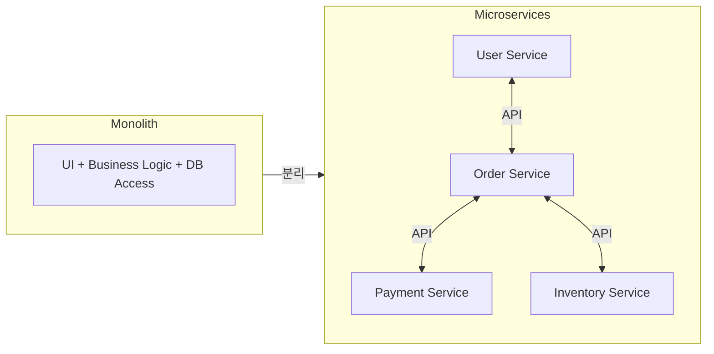
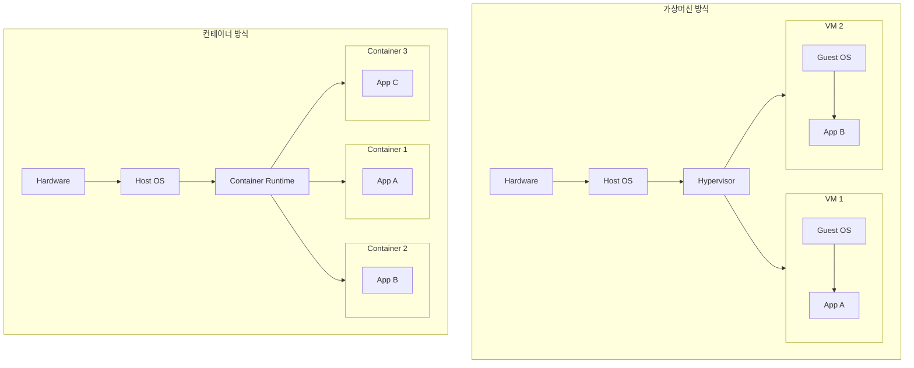
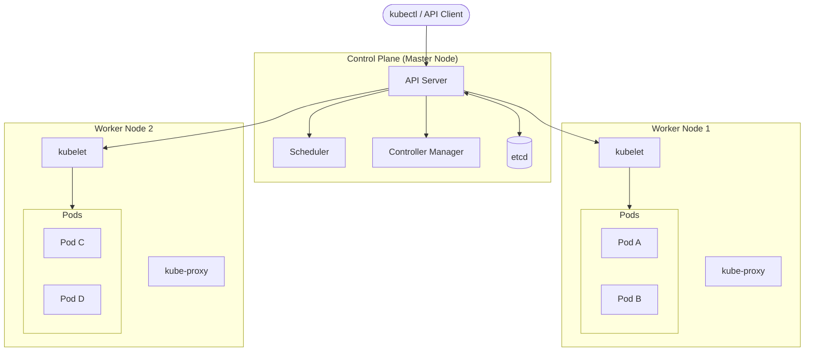
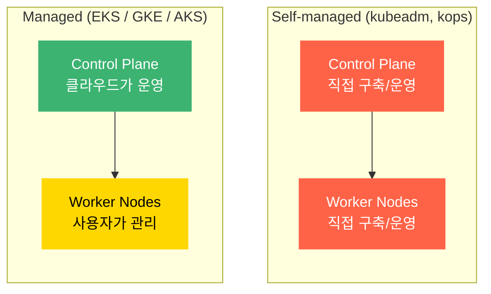
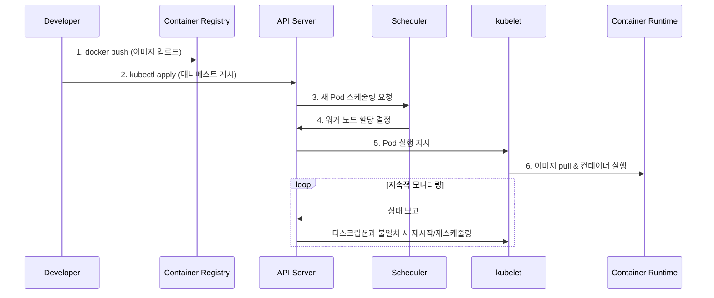
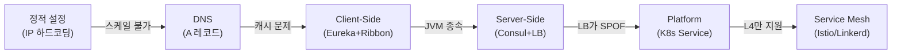
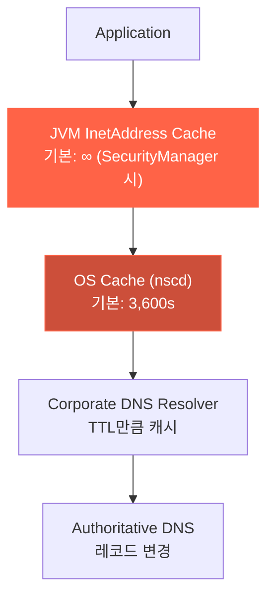
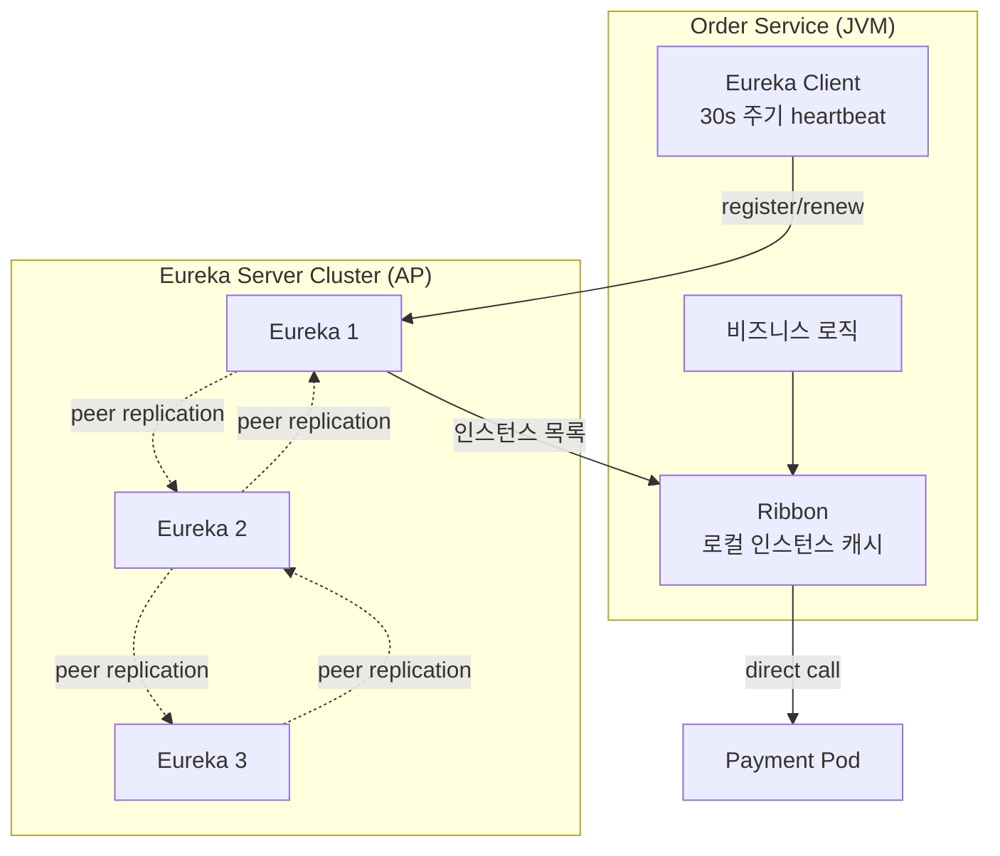
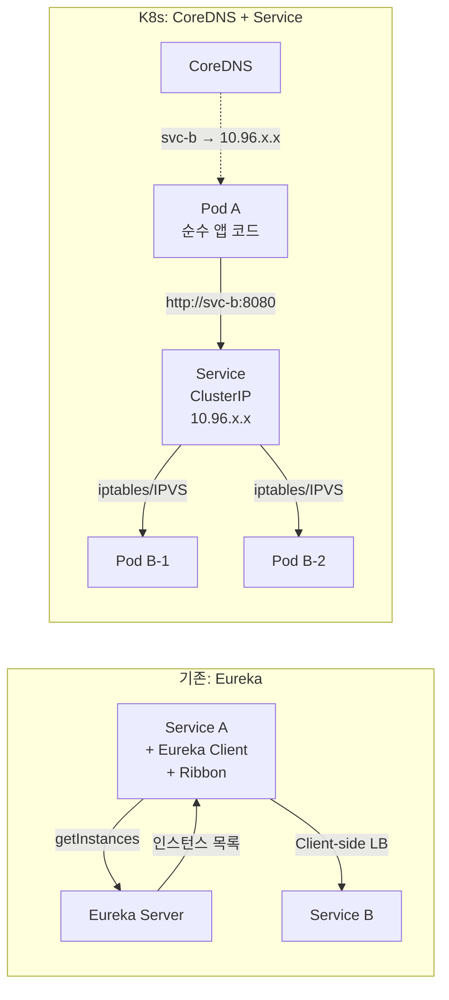
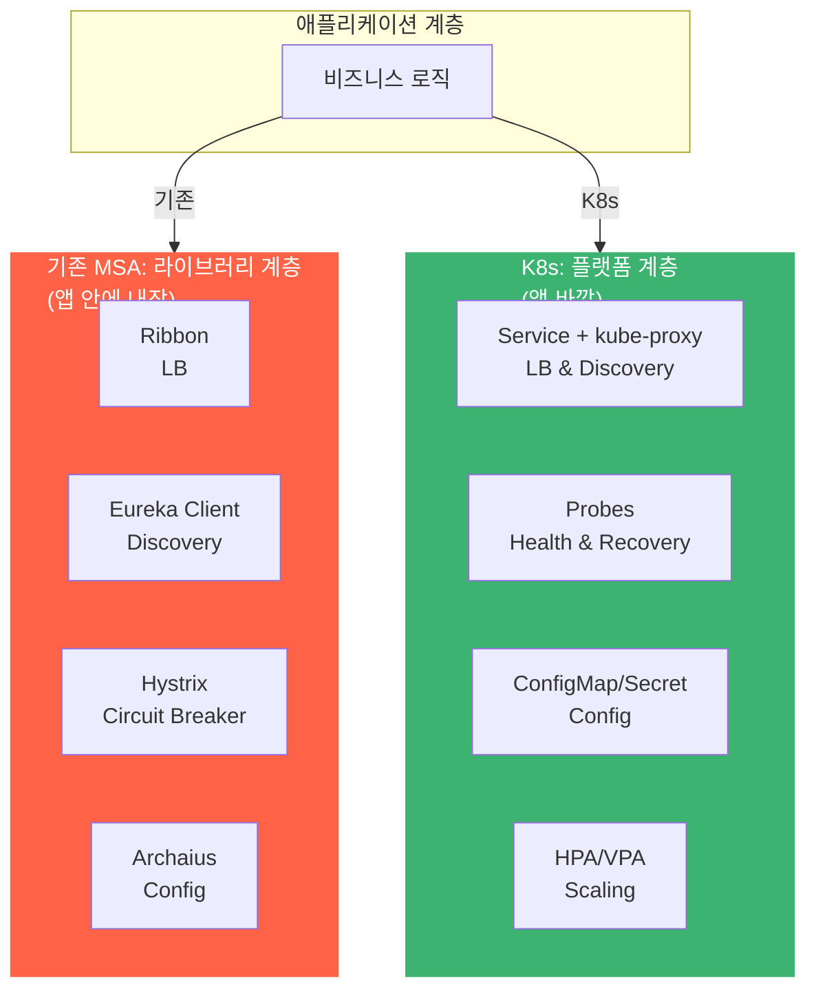

# Chapter 1: 쿠버네티스 소개

## 1.1 쿠버네티스와 같은 시스템이 필요한 이유

### 모놀리스에서 마이크로서비스로



- 모놀리스와 달리 마이크로서비스는 개별적으로 개발, 배포가 가능하다.
- 하지만 새로운 문제가 발생한다:
    - 상호 종속성 수가 높아지므로 배포 관련 결정이 어려워진다
    - 서로를 찾아 통신해야 하는 과정에서 구성이 어렵다 (서비스 디스커버리)
    - 서로 다른 버전의 라이브러리를 필요로 하는 경우가 발생한다
- 스케일링 차이
    - **모놀리스**: 수직 스케일링(비용↑, 한계) 또는 수평 스케일링(전체 복제 필요)
    - **마이크로서비스**: 필요한 서비스만 독립적으로 스케일링 가능

### 일관된 환경 제공

- 마이크로서비스가 동일 OS에서 **서로 다른 버전의 라이브러리**를 필요로 하면 충돌 발생
- "내 로컬에서는 되는데" 문제 → 개발/스테이징/프로덕션 환경 차이
- **컨테이너**가 각 서비스를 자체 환경과 함께 패키징하여 해결

### 데브옵스와 NoOps

- **DevOps**: 개발 팀이 애플리케이션을 배포하고 관리
- **NoOps**: 쿠버네티스가 인프라를 추상화하여 개발자가 운영 없이 배포 가능
- 시스템 관리자는 개별 앱 대신 쿠버네티스 인프라 자체를 관리

---

## 1.2 컨테이너 기술 소개

### 컨테이너 vs 가상머신



| 비교 항목 | 가상머신 | 컨테이너 |
|-----------|---------|---------|
| 격리 수준 | 완벽 (별도 커널) | 프로세스 수준 (커널 공유) |
| 오버헤드 | GB 단위 RAM | MB 단위 |
| 시작 시간 | 분 단위 | 초 단위 |
| 밀도 | 낮음 | 높음 |
| 보안 | 강함 | 커널 공유로 인한 리스크 |

- 하이퍼바이저 유형:
    - **Type 1** (Bare-metal): 호스트 OS 불필요 (ESXi, Hyper-V)
    - **Type 2** (Hosted): 호스트 OS 위에서 동작 (VirtualBox, VMware Workstation)

### 컨테이너 격리 메커니즘

- **Linux Namespaces**: 프로세스별 독립된 시스템 뷰 제공
    - Mount, PID, Network, IPC, UTS(hostname), User ID
- **Linux cgroups**: 프로세스의 리소스 사용량 제한 (CPU, 메모리, 디스크 I/O, 네트워크)

> Docker 자체가 격리를 제공하는 것이 아니라, 리눅스 커널의 Namespace + cgroups를 쉽게 사용할 수 있게 해주는 플랫폼이다.

### Docker

- 컨테이너를 여러 시스템에 쉽게 이식 가능하게 하는 최초의 컨테이너 시스템
- 핵심 개념:
    - **이미지**: 애플리케이션 + 환경을 레이어로 패키지화
    - **레지스트리**: 이미지 저장소 (Docker Hub 등)
    - **컨테이너**: 이미지의 실행 인스턴스 (격리된 프로세스)
- 이미지 레이어: 여러 이미지가 동일 레이어를 공유 → 저장 공간/전송 효율
- 제한: 리눅스 커널 기반이므로 특정 커널 기능이 필요하면 해당 환경에서만 동작

### 도커의 대안: rkt

- OCI(Open Container Initiative) 표준 준수
- 보안, 조합성 강조
- 현재는 deprecated (2018년 당시 대안으로 소개)

---

## 1.3 쿠버네티스 소개

### 기원

- Google이 내부에서 수십만 개의 작업을 관리하던 **Borg** → **Omega** 시스템의 경험을 바탕으로
- 2014년 오픈소스로 공개, 개발자 경험에 더 집중

### 쿠버네티스 아키텍처



#### 컨트롤 플레인 구성요소 상세

##### 1) kube-apiserver — 모든 통신의 중심

클러스터의 **유일한 진입점**. 모든 구성요소(kubectl, kubelet, scheduler, controller)는 반드시 API Server를 통해서만 통신한다. etcd에 직접 접근하는 구성요소는 API Server뿐이다.

```
kubectl ──►
kubelet ──► kube-apiserver ◄──► etcd
scheduler ─►       │
controller ►       │
                   │
            (인증 → 인가 → Admission Control → etcd 저장)
```

- **RESTful API**: 모든 K8s 리소스(Pod, Service, Deployment 등)를 CRUD하는 HTTP API
- **인증(Authentication)**: 요청자가 누구인지 확인 (인증서, 토큰, OIDC 등)
- **인가(Authorization)**: 해당 사용자가 이 작업을 할 권한이 있는지 확인 (RBAC)
- **Admission Control**: 요청을 변형(Mutating)하거나 거부(Validating)하는 플러그인 체인
    - 예: `LimitRanger` — 리소스 요청이 없으면 기본값 주입
    - 예: `PodSecurityAdmission` — 보안 정책 위반 Pod 거부
- **Watch 메커니즘**: 클라이언트가 리소스 변경을 실시간으로 구독 (long-polling)
    - Controller, Scheduler, kubelet 모두 watch를 통해 변경을 감지

> API Server가 다운되면? kubectl 명령 불가, 새 스케줄링 불가. 단, **이미 실행 중인 Pod는 계속 동작**한다 (kubelet이 독립적으로 컨테이너를 유지).

##### 2) etcd — 클러스터의 뇌

클러스터의 **모든 상태**를 저장하는 분산 Key-Value 스토어. K8s에서 유일한 stateful 구성요소.

```
etcd에 저장되는 것:
├── /registry/pods/default/nginx-abc    ← Pod 정의
├── /registry/services/default/my-svc   ← Service 정의
├── /registry/deployments/...           ← Deployment 정의
├── /registry/secrets/...               ← Secret 데이터
├── /registry/configmaps/...            ← ConfigMap
└── /registry/nodes/worker-1            ← Node 상태
```

- **Raft 합의 알고리즘**: 3대 또는 5대로 클러스터링, 과반수(quorum) 합의로 데이터 기록
    - 3대: 1대 장애 허용, 5대: 2대 장애 허용
- **일관성**: Strong Consistency — 쓰기가 확정되면 어느 노드에서 읽어도 동일한 값
- **Watch**: 키 변경 시 구독자에게 이벤트 푸시 → API Server의 watch 메커니즘의 근간
- **직접 접근 금지**: API Server만 etcd에 접근. 다른 모든 구성요소는 API Server를 거침

> etcd가 죽으면? 클러스터의 **전체 상태를 잃는다**. 그래서 etcd 백업이 K8s 운영에서 가장 중요한 작업 중 하나.

##### 3) kube-scheduler — Pod를 어디에 배치할까

**Unscheduled Pod**(노드가 아직 할당되지 않은 Pod)를 감지하고, 최적의 Worker Node를 골라서 할당하는 구성요소.

```
새 Pod 생성 요청
      │
      ▼
 ┌─────────────────────────────────────┐
 │          Scheduler 의사결정          │
 │                                     │
 │  1. Filtering (걸러내기)             │
 │     - 리소스 부족한 노드 제외         │
 │     - Taint/Toleration 불일치 제외   │
 │     - NodeSelector 불일치 제외       │
 │     - 후보 노드 목록 생성            │
 │                                     │
 │  2. Scoring (점수 매기기)            │
 │     - 리소스 균형 (가장 여유로운 노드) │
 │     - Pod Affinity/Anti-Affinity    │
 │     - 데이터 로컬리티               │
 │     - 각 노드에 0~100점             │
 │                                     │
 │  3. Binding (결정)                  │
 │     - 최고 점수 노드에 Pod 할당      │
 │     - API Server에 binding 기록     │
 └─────────────────────────────────────┘
```

- **Filtering**: 조건을 만족하지 않는 노드를 제외 (리소스 부족, Taint 불일치, NodeSelector 등)
- **Scoring**: 남은 후보 노드에 점수를 매겨 최적의 노드 선택 (리소스 균형, Affinity 등)
- **Binding**: 선택된 노드에 Pod를 할당 (API Server → etcd에 기록)

> Scheduler는 **배치만** 결정한다. 실제로 컨테이너를 실행하는 것은 해당 노드의 kubelet이다.

##### 4) kube-controller-manager — Reconciliation Loop의 집합

"Desired State ≠ Actual State"를 감지하고 수정하는 **컨트롤러들의 묶음**. 하나의 프로세스 안에 여러 독립 컨트롤러가 돌아간다.

| 컨트롤러 | 하는 일 |
|---------|--------|
| **ReplicaSet Controller** | replicas: 3인데 2개만 있으면 → 1개 추가 생성 |
| **Deployment Controller** | 새 버전 배포 시 Rolling Update 관리 (새 ReplicaSet 생성 → 이전 축소) |
| **Node Controller** | Worker Node가 응답 없으면 → NotReady 표시 → Pod 재스케줄링 |
| **Job Controller** | 일회성 작업 완료 추적 (성공/실패/재시도) |
| **EndpointSlice Controller** | Service의 Pod 목록(Endpoint) 관리 → 서비스 디스커버리의 핵심 |
| **ServiceAccount Controller** | 새 네임스페이스 생성 시 default ServiceAccount 자동 생성 |
| **Namespace Controller** | 네임스페이스 삭제 시 안의 모든 리소스 정리 |

각 컨트롤러는 독립적인 **Reconciliation Loop**를 실행한다:

```
while true:
    desired = API Server에서 원하는 상태 읽기 (watch)
    actual  = API Server에서 현재 상태 읽기
    diff    = desired - actual
    if diff:
        API Server에 수정 요청 (create/delete/update)
```

> Controller Manager가 다운되면? 새로운 Reconciliation이 중단된다. Pod가 죽어도 재생성 안 됨, Deployment 롤링 업데이트 중단. 단, 이미 실행 중인 Pod는 영향 없음.

##### 5) cloud-controller-manager (클라우드 환경 전용)

클라우드 API와 연동하는 컨트롤러. EKS/GKE 같은 Managed K8s에서 자동으로 실행됨.

| 컨트롤러 | 하는 일 |
|---------|--------|
| **Node Controller** | 클라우드 VM 상태 확인, 삭제된 VM의 Node 객체 정리 |
| **Route Controller** | 클라우드 네트워크에 Pod 라우팅 테이블 설정 |
| **Service Controller** | `type: LoadBalancer` Service 생성 시 → 클라우드 LB (ALB/NLB) 자동 프로비저닝 |

```yaml
# 이것만 적용하면
apiVersion: v1
kind: Service
metadata:
  name: my-app
spec:
  type: LoadBalancer   # ← cloud-controller-manager가 감지
  ports:
  - port: 80
# → AWS에서 자동으로 NLB/ALB가 생성됨
```

#### 워커 노드 구성요소 상세

##### kubelet — 노드의 에이전트

각 Worker Node에서 실행되며, API Server의 지시를 받아 **컨테이너를 실제로 실행/관리**하는 에이전트.

- API Server를 watch하여 자기 노드에 할당된 Pod를 감지
- Container Runtime(containerd, CRI-O)에 컨테이너 실행 지시
- **Liveness/Readiness/Startup Probe** 실행 → 실패 시 컨테이너 재시작 또는 Endpoint 제거
- 노드 상태(CPU, 메모리, 디스크)를 주기적으로 API Server에 보고
- **Static Pod**: API Server 없이도 로컬 파일(`/etc/kubernetes/manifests/`)의 Pod를 실행 가능
    - Control Plane 구성요소(API Server, etcd 등)가 실은 kubelet의 Static Pod로 실행됨

> kubelet은 **K8s 구성요소 중 유일하게 컨테이너가 아닌 시스템 프로세스**로 실행된다. kubelet이 컨테이너를 관리하므로, 자기 자신은 컨테이너일 수 없다.

##### kube-proxy — 서비스 네트워킹

각 Worker Node에서 실행되며, Service의 ClusterIP로 들어오는 트래픽을 실제 Pod로 라우팅한다.

- API Server를 watch하여 Service/EndpointSlice 변경 감지
- 변경 시 노드의 iptables/IPVS 규칙을 업데이트
- 구현 모드:
    - **iptables** (기본): 규칙 순회 O(n), 소규모에 적합
    - **IPVS**: 해시 테이블 O(1), 대규모(10k+ 서비스)에 적합
    - **nftables** (K8s 1.31+): iptables 후계자

### Self-managed vs Managed Kubernetes

책에서는 직접 구축하는 K8s를 설명하지만, 실무에서는 대부분 **클라우드 Managed K8s**를 사용한다.



#### 핵심 차이: 컨트롤 플레인을 누가 관리하는가

| | Self-managed | Managed (EKS/GKE/AKS) |
|---|---|---|
| **API Server** | 직접 설치, HA 구성 | 클라우드가 운영, 엔드포인트만 제공 |
| **etcd** | 직접 클러스터링, 백업, 복구 | **완전 관리** (접근 불가, 백업 자동) |
| **Scheduler / CM** | 직접 설치, 설정 | 클라우드가 운영 |
| **컨트롤 플레인 HA** | 직접 multi-master 구성 | **기본 HA** (multi-AZ 자동) |
| **K8s 버전 업그레이드** | 직접 수행 (다운타임 리스크) | 콘솔/CLI로 트리거, 자동 롤링 |
| **Worker Nodes** | 직접 프로비저닝 | 사용자가 관리 (또는 Fargate/Autopilot) |
| **비용** | 인프라 + 운영 인력 | 컨트롤 플레인 시간당 과금 |

> EKS/GKE에서 `kubectl get nodes` 하면 **Worker Node만** 보인다. Control Plane 노드는 클라우드 인프라에 숨겨져 있어 사용자가 접근할 수 없다.

#### 클라우드별 특징

**AWS EKS**
- 컨트롤 플레인: 3개 AZ에 자동 분산, $0.10/hr (~월 $73)
- Worker: EC2 직접 관리 / **Managed Node Group** (자동 AMI 업데이트) / **Fargate** (서버리스, 노드 관리 완전 불필요)
- etcd: AWS 내부에서 관리, 사용자 접근 불가

**GCP GKE**
- 컨트롤 플레인: **무료** (Zonal), $0.10/hr (Regional HA)
- Worker: 직접 관리 / **Autopilot** (노드 자동 관리 + Pod 단위 과금, 노드 개념 추상화)
- GKE Autopilot은 Worker Node조차 사용자가 관리하지 않음 → 가장 추상화 수준이 높음

**Azure AKS**
- 컨트롤 플레인: **무료** (SLA 없음), 유료 Uptime SLA ($0.10/hr)
- Worker: VM Scale Sets / **Virtual Nodes** (ACI 기반 서버리스)

#### 추상화 수준 스펙트럼

```
관리 부담 높음 ◄──────────────────────────────► 관리 부담 낮음

 kubeadm      EKS +        EKS +         GKE
 (직접구축)    EC2 Nodes    Fargate      Autopilot
    │             │            │            │
 CP + Worker   Worker만      Pod만       Pod만 +
 모두 관리     관리          관리       노드도 자동
```

> **책에서 배우는 것**: K8s 내부 구조 (etcd, scheduler, kubelet 등)를 이해하는 것이 중요한 이유는, Managed K8s를 쓰더라도 **디버깅, 성능 튜닝, 아키텍처 결정** 시 이 지식이 필수적이기 때문이다.

### 애플리케이션 실행 흐름



- 매니페스트에는 컨테이너 이미지, 복제본 수, 통신 방법, 리소스 요구량 등이 포함
- 쿠버네티스가 배포 상태와 디스크립션의 일치를 주기적으로 확인 (**선언적 모델**)
- 노드 장애 시 다른 노드에서 자동 재실행
- kube-proxy 덕분에 Pod가 이동해도 네트워크 연결 유지

### 쿠버네티스 사용의 장점

- **배포 단순화**: 어느 노드에서 실행 중인지 신경 쓸 필요 없음
- **하드웨어 활용도**: 남는 노드로 자동 이동하여 리소스 활용도 극대화
- **상태 확인과 자가 치유**: 실패한 컨테이너 자동 재시작
- **오토스케일링**: 메트릭 기반 자동 확장/축소
- **개발 단순화**: 서비스 디스커버리, 리더 선출 등을 플랫폼이 제공

---

## 1.4 Deep Dive: 서비스 디스커버리의 필요성과 진화

> 마이크로서비스에서 가장 근본적인 문제: **"상대 서비스가 어디에 있는가?"**

### 왜 서비스 디스커버리가 필요한가?

모놀리스에서는 함수 호출이면 끝이지만, 마이크로서비스에서는 **네트워크 호출**이다. 상대의 IP:Port를 알아야 한다. 클라우드 환경에서 IP는 동적이다 — 오토스케일링, 롤링 배포, 장애 복구 시 IP가 계속 바뀐다. 이 문제를 해결하는 접근법이 시대별로 진화해왔다.



---

### Stage 1: 정적 설정 — IP 하드코딩

```properties
# application.properties
payment-service.host=10.0.1.42
payment-service.port=8080
```

- 서버 3대면 동작하지만, 100대면 **운영 불가능**
- 서버 교체/스케일링할 때마다 **모든 호출자의 설정을 수동 변경 후 재배포**

---

### Stage 2: DNS 기반 디스커버리 — 왜 실패하는가

`payment-service.internal` → DNS A 레코드로 IP 목록 반환. 얼핏 충분해 보이지만:

#### 문제 1: DNS 캐시가 4중으로 쌓인다



| 캐시 레이어 | 기본 캐시 시간 | 비고 |
|------------|---------------|------|
| **JVM InetAddress** | **∞ (영원히)** | SecurityManager 있을 때 `-1`. 한번 resolve하면 JVM 재시작까지 안 바뀜 |
| OS (nscd) | 3,600s ~ 86,400s | 리눅스 1시간, Windows 24시간 |
| Corporate Resolver | TTL 값 (30~3600s) | 일부 ISP는 TTL 무시하고 자체 캐시 |
| 브라우저 | 60s (하드코딩) | Chrome/Firefox DNS TTL 무시, 자체 60초 고정 |

> DNS TTL을 5초로 설정해도, JVM이 영원히 캐싱하면 **의미 없다**.
> AWS 공식 문서에서도 [JVM TTL을 5초로 설정하라고 권고](https://docs.aws.amazon.com/sdk-for-java/latest/developer-guide/jvm-ttl-dns.html)한다.

```java
// JVM DNS 캐시 설정 — 주의: -D 시스템 프로퍼티로는 안 됨!
// WRONG:
java -Dnetworkaddress.cache.ttl=30 -jar app.jar  // 무효

// CORRECT:
java.security.Security.setProperty("networkaddress.cache.ttl", "30");
```

#### 문제 2: 커넥션 풀이 DNS를 완전히 무시한다

Apache HttpClient, OkHttp 등의 커넥션 풀은 한번 TCP 연결이 맺어지면 **DNS를 다시 조회하지 않는다:**

```
1. payment-service → DNS → 10.0.1.5 (연결 성공, 풀에 저장)
2. 10.0.1.5 인스턴스 종료, DNS가 10.0.1.7로 변경
3. 커넥션 풀에 10.0.1.5 연결이 살아있음 → DNS 재조회 안 함
4. 계속 10.0.1.5로 요청 → 연결 실패
5. 커넥션 풀 TTL 만료 후에야 (기본: 무한) DNS 재조회
```

실질적 stale routing window = `max(JVM TTL, 커넥션 풀 TTL)` = **분 ~ 무한대**

#### 문제 3: DNS Round-Robin은 로드밸런싱이 아니다

- **glibc가 응답 순서를 재정렬** (RFC 6724) → 같은 서브넷 클라이언트는 항상 같은 IP
- 기업 DNS resolver 1대가 10,000 클라이언트에 **동일한 캐시 IP** 제공 → 특정 인스턴스 편중
- **건강 체크 없음** — 인스턴스가 죽어도 DNS 레코드에 남아있음

#### 문제 4: SRV 레코드도 답이 아니다

DNS SRV 레코드는 포트, 가중치, 우선순위를 제공하지만:
- RFC 2782가 **HTTP에 SRV 사용을 금지** → 모든 HTTP 클라이언트(curl, HttpClient, OkHttp 등) 미지원
- HTTP/2 워킹 그룹도 [SRV 지원을 명시적으로 거부](https://lists.w3.org/Archives/Public/ietf-http-wg/2015AprJun/0674.html)

---

### Stage 3: Client-Side Discovery — Eureka + Ribbon

Netflix가 2012년 크리스마스 이브 AWS ELB 장애를 겪은 후, "중앙 LB를 거치지 않는 구조"를 만들기 위해 개발.



**장점**: 프록시 hop 없음, 레지스트리 다운 시 로컬 캐시로 기존 서비스 통신 유지

#### Eureka의 치명적 문제들

**1) Self-Preservation Mode — 좀비 인스턴스**

heartbeat 수신이 전체의 85% 미만이면 **모든 인스턴스 제거를 중단**한다:

```
인스턴스 10개 중 2개 죽음 → heartbeat 80% < 85% threshold
→ Self-preservation 발동
→ 죽은 2개 인스턴스가 레지스트리에 영구 유지 (좀비)
→ 트래픽이 좀비에게 계속 전달
→ 수동 개입 없이는 복구 안 됨
```

> 작은 클러스터일수록 더 심각: 인스턴스 3개 중 1개 죽으면 → 66% < 85% → 즉시 발동

**2) 죽은 인스턴스 제거까지 worst-case 5분 30초**

Eureka 소스 코드의 `renew()` 메서드에 **알려진 버그**가 있어서 lease 만료가 2배로 걸린다:

```java
// Lease.java — Netflix/eureka 소스
public void renew() {
    lastUpdateTimestamp = System.currentTimeMillis() + duration;
    // ↑ 버그: now + duration으로 설정해서 isExpired()에서 2×duration 후에야 만료
}
```

```
T+0s     인스턴스 ungraceful 종료
T+180s   Lease 만료 (90s × 2 = 180s, renew 버그)
T+240s   EvictionTask 실행 (최대 60s 간격)
T+270s   서버 response 캐시 갱신 (30s)
T+300s   클라이언트 레지스트리 fetch (30s)
T+330s   Ribbon ServerList 갱신 (30s)
─────────────────────────────────────
총 worst-case: ~5분 30초 동안 죽은 인스턴스로 트래픽 전송
```

**3) Eureka 전체 장애 시**

| 영향 | 상세 |
|------|------|
| 기존 서비스 통신 | 로컬 캐시로 **유지됨** (즉시 전사 장애는 아님) |
| 새 배포 | **불가** — 새 인스턴스가 등록 못 함 → 트래픽 0 |
| 죽은 인스턴스 | **제거 불가** — 좀비 상태로 계속 트래픽 수신 |
| 캐시 stale | Ribbon 캐시가 마지막 상태로 고정 → 부분 장애 확산 |

**4) 캐시 체인 — 5중 캐시**

```
Eureka Server Registry
  → Server Response Cache (30s)
    → Eureka Client Cache (30s)
      → Ribbon ServerList Cache (30s)
        → HTTP Connection Pool (∞)
```

각 레이어마다 30초씩 지연이 누적된다.

---

### Stage 4: Server-Side Discovery — Consul + LB

- Consul = **CP 모델** (Raft 합의) → 일관된 레지스트리, 좀비 없음
- HAProxy/NGINX가 Consul을 watch → 동적 백엔드 풀 업데이트
- **장점**: 언어 무관, 중앙 정책 관리
- **문제**: LB가 새로운 **SPOF & 병목**, Raft 리더 선출 시 **30~120초 불가용**

| | Eureka (AP) | Consul (CP) | ZooKeeper (CP) |
|---|---|---|---|
| 파티션 시 | 항상 가용, stale 데이터 | 쓰기 불가 (쿼럼 필요) | 전체 불가 (쿼럼 필요) |
| 좀비 인스턴스 | Self-preservation으로 가능 | 없음 (건강체크 즉시 제거) | 세션 만료로 제거 |
| 리더 선출 | 없음 (P2P) | Raft (30~120초) | ZAB (30~120초) |
| Split-brain | **가능** (divergent registry) | Raft가 방지 | ZAB가 방지 |

---

### Stage 5: K8s가 해결한 방법

#### DNS 문제 해결: ClusterIP (가상 IP)

K8s는 DNS를 "인스턴스 IP 목록 반환"이 아니라 **"안정된 가상 IP 1개 반환"**으로 바꿨다:

```
CoreDNS: payment-service → 10.96.100.1 (ClusterIP, 고정)
                                 │
                          kube-proxy (커널)
                           iptables/IPVS
                          ┌──────┼──────┐
                          ▼      ▼      ▼
                       Pod A   Pod B   Pod C
                     (실제 IP는 수시로 변경)
```

- 앱은 **ClusterIP 하나만** 알면 됨 → DNS 캐시가 stale해도 ClusterIP는 안 바뀜
- **커넥션 풀 문제 해소**: ClusterIP로 연결하면 커널이 매 패킷마다 실제 Pod로 라우팅
- JVM DNS 캐시 문제도 사실상 무관 — ClusterIP가 변하지 않으므로

#### 레지스트리 SPOF 해결: 별도 레지스트리 없음

```
Eureka 방식: App → Eureka Client → Eureka Server (별도 프로세스) → IP 목록
K8s 방식:    App → DNS → ClusterIP → kube-proxy (모든 노드에 존재) → Pod
```

- etcd에 상태가 내장, 별도 레지스트리 프로세스가 없음
- kube-proxy가 **모든 Worker Node에** DaemonSet으로 실행 → 단일 장애점 없음
- Endpoint Controller가 API Server를 **watch**하여 변경 즉시 반영

#### Stale 인스턴스 해결: Readiness Probe + 즉시 제거

| 시나리오 | Eureka | K8s |
|---------|--------|-----|
| Graceful 종료 | 30~330초 (heartbeat + 캐시 체인) | **~2-5초** (endpoint `ready=false` 즉시) |
| Ungraceful 종료 | 180~330초 (renew 버그 + 캐시 체인) | **~30초** (readiness probe 3회 실패) |
| 좀비 인스턴스 | Self-preservation으로 무한 유지 가능 | **불가능** (readiness probe가 지속 검증) |
| 새 인스턴스 가시성 | 30~60초 (등록 + 캐시 전파) | **~5-10초** (Pod Ready → EndpointSlice) |

#### K8s의 3-state 모델 (Eureka에 없는 것)

```yaml
# EndpointSlice conditions (K8s v1.26+)
conditions:
  ready: false        # ← 로드밸런서가 트래픽 중단
  serving: true       # ← 진행 중인 요청은 계속 처리
  terminating: true   # ← graceful shutdown 중
```

Eureka는 UP/DOWN 이진 상태만 있지만, K8s는 **ready/serving/terminating** 3가지 상태로 **Zero-downtime 롤링 업데이트**를 가능하게 한다.

---

### Stage 6: Service Mesh — 그 다음 단계

K8s Service는 **L4 (TCP/UDP)** — HTTP 헤더, gRPC 메타데이터를 모름:

| | K8s Service | Service Mesh (Istio/Linkerd) |
|---|---|---|
| mTLS | ❌ | ✅ 자동, 코드 변경 없음 |
| Retry/Timeout | ❌ | ✅ 선언적 정책 |
| Circuit Breaking | ❌ | ✅ outlier detection |
| Canary 배포 | ❌ | ✅ 트래픽 % 분할 |
| 분산 추적 | ❌ | ✅ 자동 span 전파 |

> Service Mesh는 sidecar 프록시(Envoy)가 모든 트래픽을 가로채서 L7 기능을 제공한다.
> Trade-off: 레이턴시 +1~3ms/hop, 메모리 200~400MB/pod, 운영 복잡도 증가.

---

## 1.5 Traditional MSA vs Kubernetes (종합 비교)

> 쿠버네티스 이전에 마이크로서비스 아키텍처는 어떻게 구축되었고, 쿠버네티스가 어떻게 개선했는가?

### 전체 아키텍처 비교


> 핵심 변화: 기존 MSA는 인프라 관심사를 **애플리케이션 라이브러리**(Ribbon, Eureka Client, Hystrix)에 넣었지만, K8s는 이를 **플랫폼 계층**으로 이동시켰다.

### 영역별 상세 비교

#### 1) 서비스 디스커버리



| | Eureka + Ribbon | K8s Service + CoreDNS |
|---|---|---|
| 레지스트리 | 별도 Eureka Server 운영 필요 | 컨트롤 플레인에 내장 |
| 언어 지원 | JVM 중심 (Eureka Client) | **언어 무관 (DNS)** |
| Stale 엔트리 | 최대 90초 (heartbeat 3회 미수신) | **Endpoint Controller가 즉시 갱신** |
| 앱 코드 결합 | `DiscoveryClient` 코드 필요 | **제로 — DNS 이름만 사용** |

#### 2) 내부 통신 & 로드 밸런싱

| | Ribbon + Feign | kube-proxy (iptables/IPVS) |
|---|---|---|
| LB 위치 | 앱 프로세스 내부 (in-process) | **커널 레벨** |
| 인스턴스 캐시 | Eureka 전파 지연으로 stale 가능 | API Server 직접 watch |
| IPVS 모드 | - | **O(1) 조회** (10k+ 서비스에서 유리) |
| L7 라우팅 | Zuul/Spring Cloud Gateway | Ingress + Istio (서비스 메시) |

#### 3) 설정 관리

| | Spring Cloud Config Server | ConfigMap + Secret |
|---|---|---|
| 별도 서비스 | Config Server 운영 필요 | **불필요** |
| 언어 지원 | Spring 전용 | **언어 무관** |
| 변경 반영 | Spring Cloud Bus (RabbitMQ) | Reloader 또는 Spring Cloud K8s |
| 감사 추적 | 커스텀 로깅 | **Git 히스토리 (GitOps)** |

#### 4) 상태 확인 & 자가 치유

| | Actuator + Eureka 제거 (90s) | K8s Probes |
|---|---|---|
| 감지 → 조치 | 수동 모니터링 + 스크립트 | **kubelet이 자동으로 재시작** |
| 부분 장애 | 구분 없음 (죽거나 살거나) | **Liveness vs Readiness 구분** |
| Readiness | 없음 | 트래픽 제거만 (재시작 안 함) — 일시적 장애에 적합 |

> **핵심**: Readiness probe 실패 시 Service에서 제외만 하고 재시작하지 않는다. DB 일시 장애 같은 상황에서 불필요한 재시작을 방지.

#### 5) 스케일링

| | VM 기반 (ASG) | K8s HPA/VPA/KEDA |
|---|---|---|
| 단위 | VM (분 단위 프로비저닝) | **Pod (초 단위)** |
| 트리거 | CPU만 (CloudWatch) | CPU, 메모리, 커스텀 메트릭, 이벤트 |
| Scale-to-zero | 불가능 | **KEDA로 가능** |
| 세분성 | VM 단위 (서비스 단위 불가) | **서비스(Pod) 단위** |

#### 6) 배포 전략

| | Spinnaker / Jenkins 스크립트 | K8s Deployment + Argo |
|---|---|---|
| Rolling Update | 커스텀 파이프라인 | **내장, 선언적** |
| 운영 비용 | Spinnaker 8+ 서비스 운영 | Argo Rollouts = CRD 1개 |
| 선언적 | 아니오 (명령형 파이프라인) | **YAML 매니페스트 in Git** |
| Drift 감지 | 없음 | **ArgoCD 지속 동기화** |

### 종합: 인프라 관심사의 이동



| 관심사 | 기존 (앱 내 라이브러리) | K8s (플랫폼 계층) |
|--------|------------------------|-------------------|
| 서비스 디스커버리 | Eureka Client + Ribbon | CoreDNS + ClusterIP |
| 로드 밸런싱 | Ribbon (in-process) | iptables/IPVS (kernel) |
| API 게이트웨이 | Zuul / Spring Cloud Gateway | Ingress + Istio |
| 설정 관리 | Spring Cloud Config Server | ConfigMap + Secret |
| 상태 확인 / 복구 | Actuator + Eureka 제거 (90s) | Liveness/Readiness Probes (5s) |
| 스케일링 | 수동 / ASG (VM, 분 단위) | HPA/VPA/KEDA (Pod, 초 단위) |
| 배포 | Spinnaker (8 서비스) / Jenkins | Deployment + Argo Rollouts |

> **Trade-off**: K8s가 앱을 단순화하는 대신, 플랫폼 운영 복잡도가 증가한다. 인프라 팀의 K8s 전문성이 필수적이다.

---

## 1.6 요약

- 모놀리스는 배포가 쉽지만, 유지보수와 스케일링이 어렵다
- 마이크로서비스는 개별 개발이 쉽지만, 하나의 시스템으로 배포/구성하기 어렵다
- 컨테이너는 VM과 유사한 격리를 훨씬 가볍게 제공한다
- Docker는 컨테이너화된 앱의 패키징/배포를 단순화했다
- 쿠버네티스는 전체 데이터센터를 하나의 컴퓨팅 리소스로 추상화한다
- 개발자는 시스템 관리자 없이 K8s를 통해 앱을 배포할 수 있다
- 서비스 디스커버리는 정적 설정 → DNS → Client-Side(Eureka) → Server-Side(Consul) → Platform(K8s) → Service Mesh로 진화했다
    - 각 단계는 이전 단계의 근본 문제를 해결했지만, 새로운 제약을 도입했다
    - K8s는 ClusterIP(고정 가상 IP) + kube-proxy(커널 레벨 라우팅)로 DNS 캐시/커넥션 풀/레지스트리 SPOF 문제를 구조적으로 해결했다
- 기존 MSA의 인프라 관심사(디스커버리, LB, 설정, 복구, 스케일링)를 앱 라이브러리에서 플랫폼 계층으로 이동시켰다
