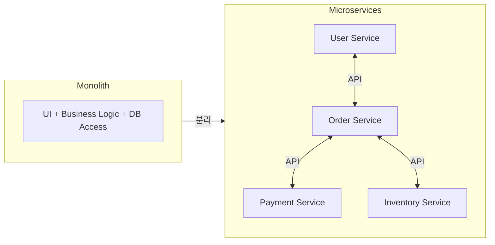
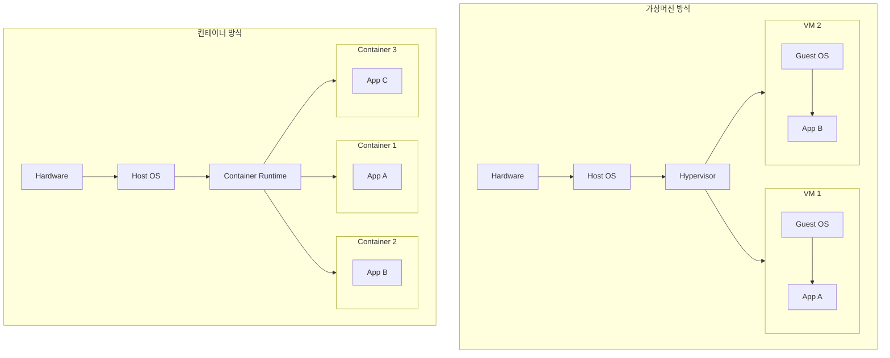
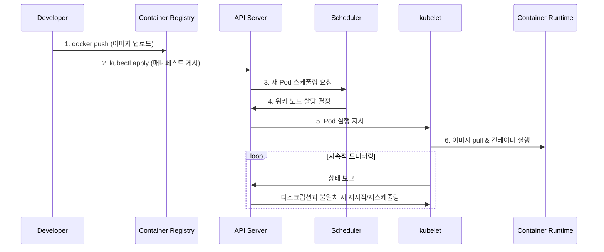
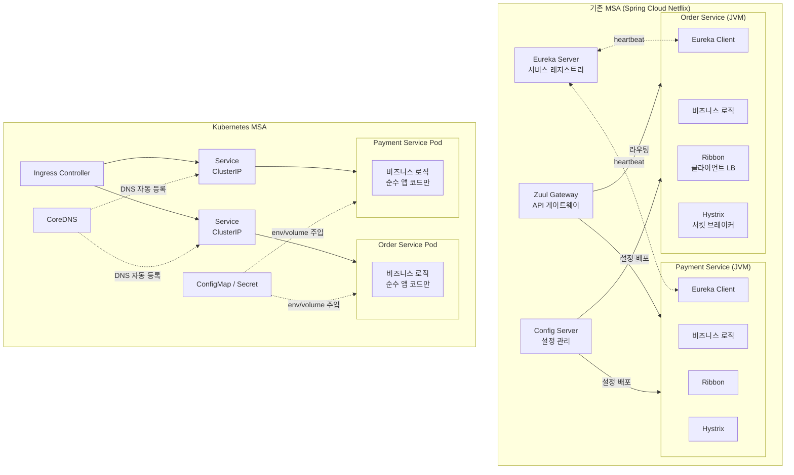
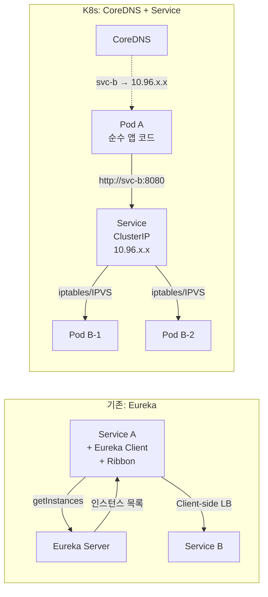
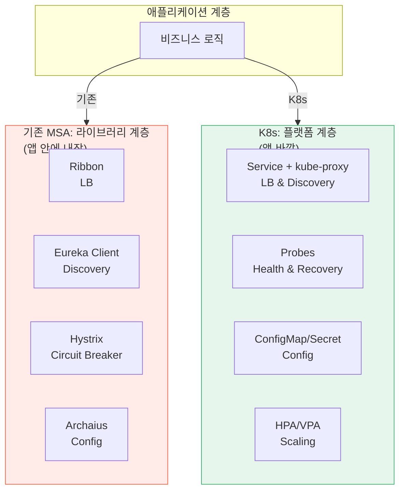

# Chapter 1: 쿠버네티스 소개

## 1.1 쿠버네티스와 같은 시스템이 필요한 이유

### 모놀리스에서 마이크로서비스로

- 모놀리스와 달리 마이크로서비스는 개별적으로 개발, 배포가 가능하다.
- 하지만 새로운 문제가 발생한다:
    - 상호 종속성 수가 높아지므로 배포 관련 결정이 어려워진다
    - 서로를 찾아 통신해야 하는 과정에서 구성이 어렵다 (서비스 디스커버리)
    - 서로 다른 버전의 라이브러리를 필요로 하는 경우가 발생한다
- 스케일링 차이
    - **모놀리스**: 수직 스케일링(비용↑, 한계) 또는 수평 스케일링(전체 복제 필요)
    - **마이크로서비스**: 필요한 서비스만 독립적으로 스케일링 가능

### 일관된 환경 제공

- 마이크로서비스가 동일 OS에서 **서로 다른 버전의 라이브러리**를 필요로 하면 충돌 발생
- "내 로컬에서는 되는데" 문제 → 개발/스테이징/프로덕션 환경 차이
- **컨테이너**가 각 서비스를 자체 환경과 함께 패키징하여 해결

### 데브옵스와 NoOps

- **DevOps**: 개발 팀이 애플리케이션을 배포하고 관리
- **NoOps**: 쿠버네티스가 인프라를 추상화하여 개발자가 운영 없이 배포 가능
- 시스템 관리자는 개별 앱 대신 쿠버네티스 인프라 자체를 관리

---

## 1.2 컨테이너 기술 소개

### 컨테이너 vs 가상머신

| 비교 항목 | 가상머신 | 컨테이너 |
|-----------|---------|---------|
| 격리 수준 | 완벽 (별도 커널) | 프로세스 수준 (커널 공유) |
| 오버헤드 | GB 단위 RAM | MB 단위 |
| 시작 시간 | 분 단위 | 초 단위 |
| 밀도 | 낮음 | 높음 |
| 보안 | 강함 | 커널 공유로 인한 리스크 |

- 하이퍼바이저 유형:
    - **Type 1** (Bare-metal): 호스트 OS 불필요 (ESXi, Hyper-V)
    - **Type 2** (Hosted): 호스트 OS 위에서 동작 (VirtualBox, VMware Workstation)

### 컨테이너 격리 메커니즘

- **Linux Namespaces**: 프로세스별 독립된 시스템 뷰 제공
    - Mount, PID, Network, IPC, UTS(hostname), User ID
- **Linux cgroups**: 프로세스의 리소스 사용량 제한 (CPU, 메모리, 디스크 I/O, 네트워크)

> Docker 자체가 격리를 제공하는 것이 아니라, 리눅스 커널의 Namespace + cgroups를 쉽게 사용할 수 있게 해주는 플랫폼이다.

### Docker

- 컨테이너를 여러 시스템에 쉽게 이식 가능하게 하는 최초의 컨테이너 시스템
- 핵심 개념:
    - **이미지**: 애플리케이션 + 환경을 레이어로 패키지화
    - **레지스트리**: 이미지 저장소 (Docker Hub 등)
    - **컨테이너**: 이미지의 실행 인스턴스 (격리된 프로세스)
- 이미지 레이어: 여러 이미지가 동일 레이어를 공유 → 저장 공간/전송 효율
- 제한: 리눅스 커널 기반이므로 특정 커널 기능이 필요하면 해당 환경에서만 동작

### 도커의 대안: rkt

- OCI(Open Container Initiative) 표준 준수
- 보안, 조합성 강조
- 현재는 deprecated (2018년 당시 대안으로 소개)

---

## 1.3 쿠버네티스 소개

### 기원

- Google이 내부에서 수십만 개의 작업을 관리하던 **Borg** → **Omega** 시스템의 경험을 바탕으로
- 2014년 오픈소스로 공개, 개발자 경험에 더 집중

### 쿠버네티스 아키텍처

**컨트롤 플레인 (마스터 노드)**
- **API Server**: 모든 통신의 중심 허브
- **etcd**: 클러스터 전체 상태를 저장하는 분산 KV 스토어
- **Scheduler**: 리소스 요구사항에 따라 Pod를 워커 노드에 배치
- **Controller Manager**: 복제본 관리, 노드 추적, 장애 처리

**워커 노드**
- **kubelet**: API 서버와 통신, 해당 노드의 컨테이너 관리
- **kube-proxy**: Service에 대한 네트워크 트래픽을 로드밸런싱 (iptables/IPVS)

### 애플리케이션 실행 흐름

- 매니페스트에는 컨테이너 이미지, 복제본 수, 통신 방법, 리소스 요구량 등이 포함
- 쿠버네티스가 배포 상태와 디스크립션의 일치를 주기적으로 확인 (**선언적 모델**)
- 노드 장애 시 다른 노드에서 자동 재실행
- kube-proxy 덕분에 Pod가 이동해도 네트워크 연결 유지

### 쿠버네티스 사용의 장점

- **배포 단순화**: 어느 노드에서 실행 중인지 신경 쓸 필요 없음
- **하드웨어 활용도**: 남는 노드로 자동 이동하여 리소스 활용도 극대화
- **상태 확인과 자가 치유**: 실패한 컨테이너 자동 재시작
- **오토스케일링**: 메트릭 기반 자동 확장/축소
- **개발 단순화**: 서비스 디스커버리, 리더 선출 등을 플랫폼이 제공

---

## 1.4 Traditional MSA vs Kubernetes

> 쿠버네티스 이전에 마이크로서비스 아키텍처는 어떻게 구축되었고, 쿠버네티스가 어떻게 개선했는가?

### 전체 아키텍처 비교

> 핵심 변화: 기존 MSA는 인프라 관심사를 **애플리케이션 라이브러리**(Ribbon, Eureka Client, Hystrix)에 넣었지만, K8s는 이를 **플랫폼 계층**으로 이동시켰다.

### 영역별 상세 비교

#### 1) 서비스 디스커버리

| | Eureka + Ribbon | K8s Service + CoreDNS |
|---|---|---|
| 레지스트리 | 별도 Eureka Server 운영 필요 | 컨트롤 플레인에 내장 |
| 언어 지원 | JVM 중심 (Eureka Client) | **언어 무관 (DNS)** |
| Stale 엔트리 | 최대 90초 (heartbeat 3회 미수신) | **Endpoint Controller가 즉시 갱신** |
| 앱 코드 결합 | `DiscoveryClient` 코드 필요 | **제로 — DNS 이름만 사용** |

#### 2) 내부 통신 & 로드 밸런싱

| | Ribbon + Feign | kube-proxy (iptables/IPVS) |
|---|---|---|
| LB 위치 | 앱 프로세스 내부 (in-process) | **커널 레벨** |
| 인스턴스 캐시 | Eureka 전파 지연으로 stale 가능 | API Server 직접 watch |
| IPVS 모드 | - | **O(1) 조회** (10k+ 서비스에서 유리) |
| L7 라우팅 | Zuul/Spring Cloud Gateway | Ingress + Istio (서비스 메시) |

#### 3) 설정 관리

| | Spring Cloud Config Server | ConfigMap + Secret |
|---|---|---|
| 별도 서비스 | Config Server 운영 필요 | **불필요** |
| 언어 지원 | Spring 전용 | **언어 무관** |
| 변경 반영 | Spring Cloud Bus (RabbitMQ) | Reloader 또는 Spring Cloud K8s |
| 감사 추적 | 커스텀 로깅 | **Git 히스토리 (GitOps)** |

#### 4) 상태 확인 & 자가 치유

| | Actuator + Eureka 제거 (90s) | K8s Probes |
|---|---|---|
| 감지 → 조치 | 수동 모니터링 + 스크립트 | **kubelet이 자동으로 재시작** |
| 부분 장애 | 구분 없음 (죽거나 살거나) | **Liveness vs Readiness 구분** |
| Readiness | 없음 | 트래픽 제거만 (재시작 안 함) — 일시적 장애에 적합 |

> **핵심**: Readiness probe 실패 시 Service에서 제외만 하고 재시작하지 않는다. DB 일시 장애 같은 상황에서 불필요한 재시작을 방지.

#### 5) 스케일링

| | VM 기반 (ASG) | K8s HPA/VPA/KEDA |
|---|---|---|
| 단위 | VM (분 단위 프로비저닝) | **Pod (초 단위)** |
| 트리거 | CPU만 (CloudWatch) | CPU, 메모리, 커스텀 메트릭, 이벤트 |
| Scale-to-zero | 불가능 | **KEDA로 가능** |
| 세분성 | VM 단위 (서비스 단위 불가) | **서비스(Pod) 단위** |

#### 6) 배포 전략

| | Spinnaker / Jenkins 스크립트 | K8s Deployment + Argo |
|---|---|---|
| Rolling Update | 커스텀 파이프라인 | **내장, 선언적** |
| 운영 비용 | Spinnaker 8+ 서비스 운영 | Argo Rollouts = CRD 1개 |
| 선언적 | 아니오 (명령형 파이프라인) | **YAML 매니페스트 in Git** |
| Drift 감지 | 없음 | **ArgoCD 지속 동기화** |

### 종합: 인프라 관심사의 이동

| 관심사 | 기존 (앱 내 라이브러리) | K8s (플랫폼 계층) |
|--------|------------------------|-------------------|
| 서비스 디스커버리 | Eureka Client + Ribbon | CoreDNS + ClusterIP |
| 로드 밸런싱 | Ribbon (in-process) | iptables/IPVS (kernel) |
| API 게이트웨이 | Zuul / Spring Cloud Gateway | Ingress + Istio |
| 설정 관리 | Spring Cloud Config Server | ConfigMap + Secret |
| 상태 확인 / 복구 | Actuator + Eureka 제거 (90s) | Liveness/Readiness Probes (5s) |
| 스케일링 | 수동 / ASG (VM, 분 단위) | HPA/VPA/KEDA (Pod, 초 단위) |
| 배포 | Spinnaker (8 서비스) / Jenkins | Deployment + Argo Rollouts |

> **Trade-off**: K8s가 앱을 단순화하는 대신, 플랫폼 운영 복잡도가 증가한다. 인프라 팀의 K8s 전문성이 필수적이다.

---

## 1.5 요약

- 모놀리스는 배포가 쉽지만, 유지보수와 스케일링이 어렵다
- 마이크로서비스는 개별 개발이 쉽지만, 하나의 시스템으로 배포/구성하기 어렵다
- 컨테이너는 VM과 유사한 격리를 훨씬 가볍게 제공한다
- Docker는 컨테이너화된 앱의 패키징/배포를 단순화했다
- 쿠버네티스는 전체 데이터센터를 하나의 컴퓨팅 리소스로 추상화한다
- 개발자는 시스템 관리자 없이 K8s를 통해 앱을 배포할 수 있다
- 기존 MSA의 인프라 관심사(디스커버리, LB, 설정, 복구, 스케일링)를 앱 라이브러리에서 플랫폼 계층으로 이동시켰다
